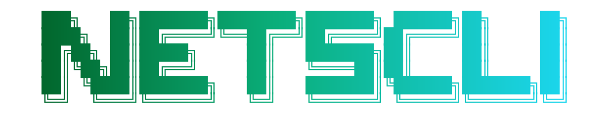
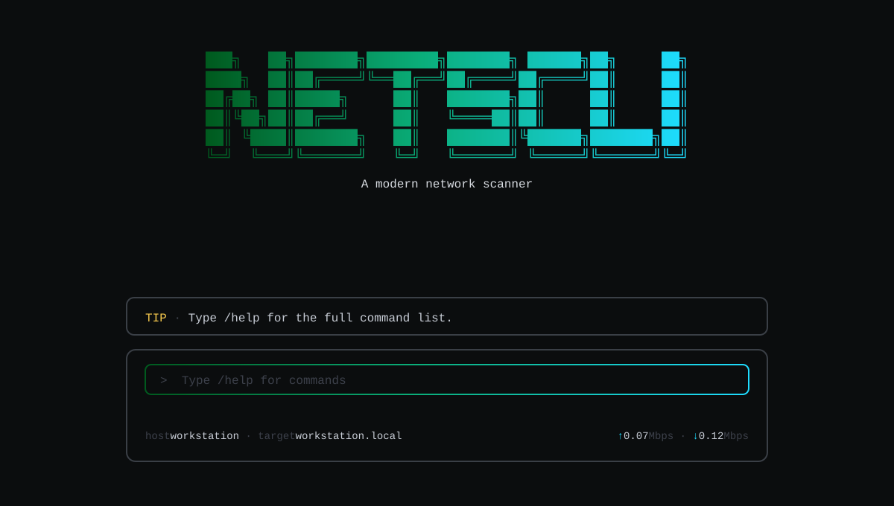
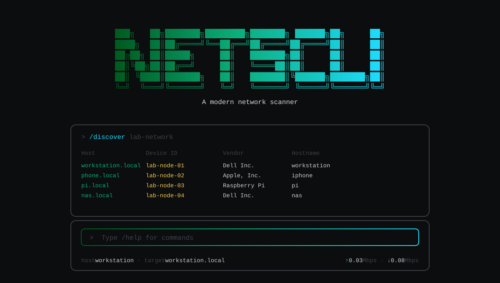
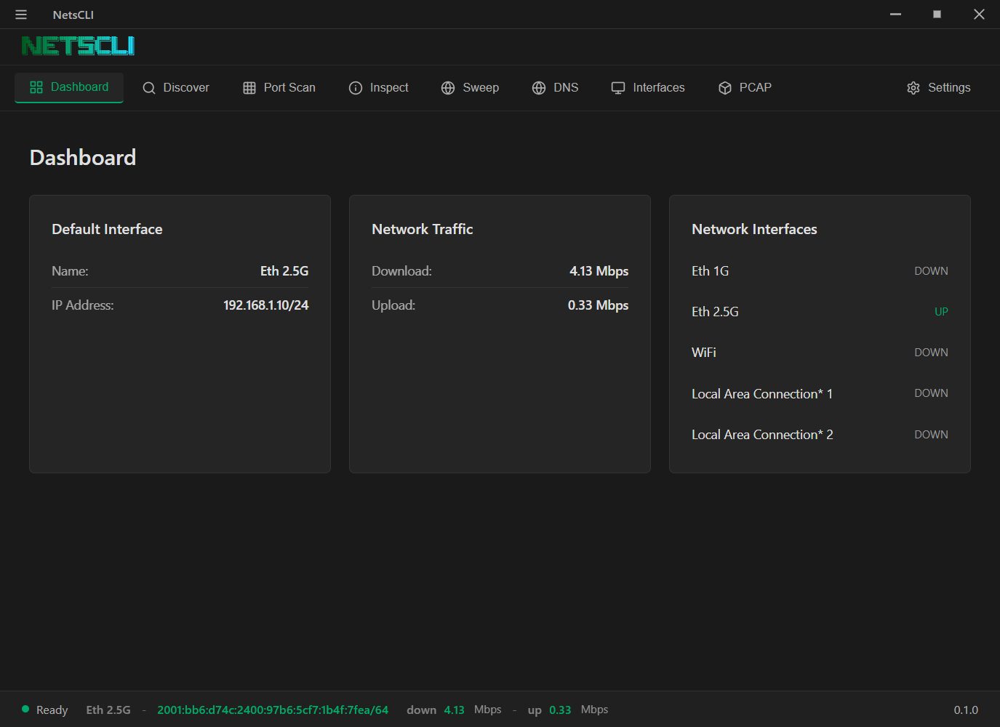
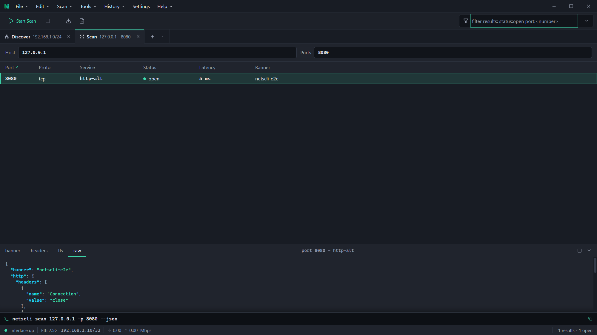
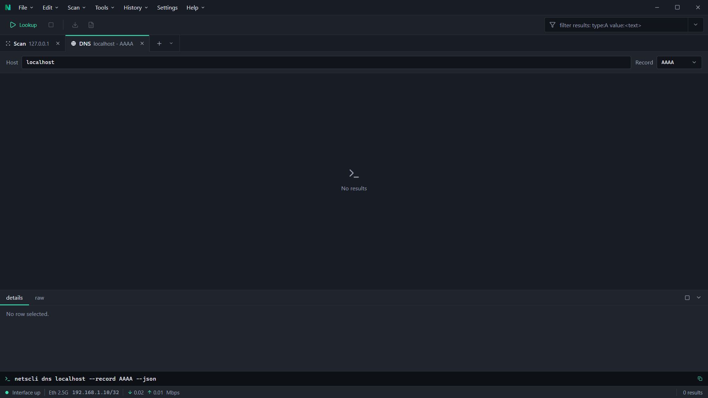
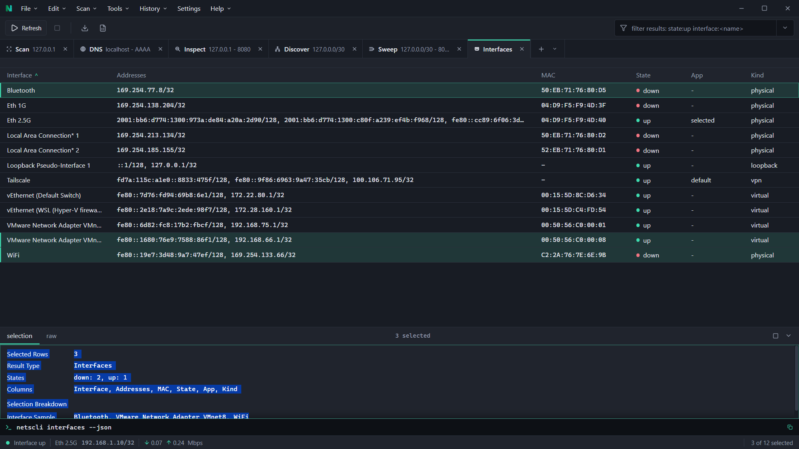
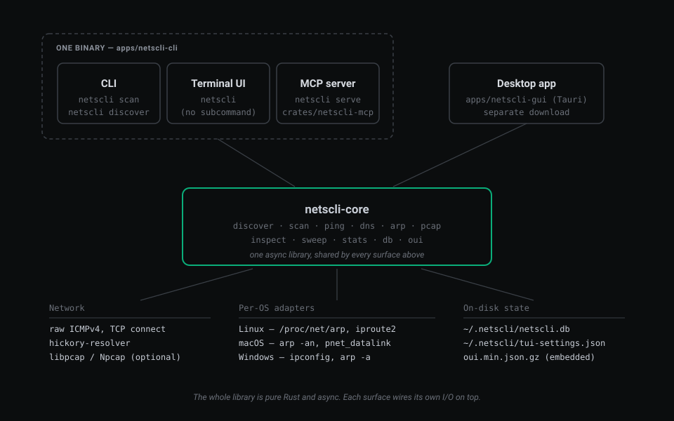

<div align="center">



*A network scanner written in Rust. CLI, terminal UI, desktop app, and MCP server. One library behind all four.*

[](https://github.com/fstubner/netscli/actions/workflows/ci.yml)
[](https://crates.io/crates/netscli)
[](https://github.com/fstubner/netscli/releases)
[](https://github.com/fstubner/netscli/releases)
[](https://www.rust-lang.org/)
[](#installation)
[](https://opensource.org/licenses/MIT)

</div>

## Table of Contents

- [Why this exists](#why-this-exists)
- [Features](#features)
- [Screenshots](#screenshots)
- [Architecture](#architecture)
- [Installation](#installation)
- [Usage](#usage)
- [Building](#building)
- [MCP Server](#mcp-server)
- [Contributing](#contributing)
- [License](#license)

## Why this exists

I wanted my AI agent to answer questions about my local network. Things
like "what's the IP of the device that just joined" or "is port 22 open
on 192.168.1.42". Existing tools work but they aren't great to drive from
an agent. Half a dozen CLI invocations, brittle output parsing, no shared
context. So I built an MCP server first. `netscli serve`, nine tools,
JSON-RPC over stdio, structured results.

Then the TUI. Coding agents like Claude Code have put real work into
autocomplete, command history, in-place progress, and mouse selection
that doesn't fight the scrollback. I wanted to see how they do it. So
netscli has a proper ratatui TUI with those affordances.

The CLI is simpler. Sometimes you just want `netscli scan host --json | jq`
and running a full MCP server for that is overkill. Cron jobs and CI
scripts want the same thing.

The desktop app is for when I don't want to open a terminal. Click an
icon, see what's on my network, close it. Because every other surface
already talked to `netscli-core`, the GUI was mostly a Tauri window over
the same Rust calls.

## Features

- Ping, port scan, host discover, subnet sweep, DNS lookup (all record types), reverse DNS, traceroute, ARP table with vendor lookup, mDNS/Bonjour device discovery, interface listing, optional packet capture.
- Four interfaces for the same core: `netscli <cmd>` for scripts, `netscli` alone for a terminal UI with autocomplete and history, a Tauri desktop app for when you want a window, and `netscli serve` for Claude / Cursor / any MCP client.
- `--json` and `--yaml` output on every non-interactive subcommand; pipe straight into jq.
- Cross-platform. Windows / Linux / macOS binaries in the release matrix. Packet capture is feature-gated so the default binary has zero non-Rust runtime deps.
- Auto-detects a reasonable subnet so `netscli discover` works with no args.

## Screenshots

### Terminal UI

<div align="center">
  
  <br/>
  
</div>

### Desktop GUI

<div align="center">
  
  <br/>
  <em>Dashboard: default interface, live up/down rates, all interfaces at a glance.</em>
  <br/><br/>
  
  <br/>
  <em>Port scan. Results show service names for well-known ports.</em>
  <br/><br/>
  
  <br/>
  <em>DNS lookup. Type and value per row, supports every standard record type.</em>
  <br/><br/>
  
  <br/>
  <em>Interfaces. Each row shows state, MAC, and every assigned address.</em>
</div>

## Architecture

<div align="center">
  
</div>

## Installation

### Quick Install (One-line)

```bash
curl -fsSL https://raw.githubusercontent.com/fstubner/netscli/main/scripts/install.sh | bash
```

This downloads the latest release binary for your platform and installs it into `~/.local/bin` by default.
You can pin a specific release by setting `NETSCLI_VERSION` (e.g. `NETSCLI_VERSION=v0.1.0`).
If the release publishes a matching `.sha256` asset, the installer will verify the download automatically; you can also set `NETSCLI_SHA256` (or `NETSCLI_SHA256_URL` to fetch a checksum file).
Release assets: Windows `x86_64`, Linux `x86_64`/`aarch64` (glibc) + Linux `x86_64` (musl), macOS `x86_64`/`aarch64`.

PCAP-enabled install (optional, adds packet capture support):

```bash
NETSCLI_PCAP=1 curl -fsSL https://raw.githubusercontent.com/fstubner/netscli/main/scripts/install.sh | bash
```

The single `NETSCLI_PCAP=1` flag does two things: it downloads the pcap-enabled binary variant *and* installs the `libpcap` system library via your package manager. If you already have libpcap installed and don't want the installer touching it, add `NETSCLI_SKIP_LIBPCAP=1`.

Windows PowerShell (same idea; `NETSCLI_PCAP=1` downloads the pcap binary and runs the Npcap installer):

```powershell
iwr -useb https://raw.githubusercontent.com/fstubner/netscli/main/scripts/install.ps1 | iex
# With PCAP:
$env:NETSCLI_PCAP=1; iwr -useb https://raw.githubusercontent.com/fstubner/netscli/main/scripts/install.ps1 | iex
```

Windows CLI installer details:
- Installs `netscli.exe` to `$env:USERPROFILE\.cargo\bin` by default (override with `INSTALL_DIR`).
- Installs from `fstubner/netscli` by default (override with `REPO`) and installs the latest release by default (override with `NETSCLI_VERSION`).
- When `NETSCLI_PCAP=1` is set: installs the `-pcap` asset and runs the Npcap installer (admin required; skip with `NETSCLI_SKIP_NPCAP=1`).
- If the release publishes a matching `.sha256` asset, the script verifies the download automatically; you can also set `NETSCLI_SHA256` or `NETSCLI_SHA256_URL`.

### From Source

```bash
git clone https://github.com/fstubner/netscli.git
cd netscli
cargo build --release -p netscli
sudo cp target/release/netscli /usr/local/bin/
```

### Using Cargo

```bash
cargo install netscli
```

Or install directly from the git tip:

```bash
cargo install --git https://github.com/fstubner/netscli netscli
```

### GUI Application

```bash
cd apps/netscli-gui
npm install
npm run tauri build
# Installers created in src-tauri/target/release/bundle/
```

**Windows note:** the desktop app requires the WebView2 runtime. Most Windows 10/11 systems already have it; if the app does not start, install the Evergreen runtime: https://developer.microsoft.com/microsoft-edge/webview2/.
The CLI installer (`scripts/install.ps1`) does not install WebView2 because it is only required for the desktop GUI.

**Output:**
- **macOS**: `.app` bundle in `src-tauri/target/release/bundle/macos/`
- **Windows**: `.exe` and `.msi` in `src-tauri/target/release/bundle/msi/`
- **Linux**: `.AppImage` and `.deb` in `src-tauri/target/release/bundle/`

### Post-Installation

Run the setup wizard to install optional dependencies:

```bash
netscli setup
```

This will interactively guide you through installing:
- `libpcap` (for packet capture)
- `tcpdump` (for PCAP functionality)

### PCAP Support (Optional)

PCAP capture is optional and disabled in the default builds for portability. To enable it:

- **Via installer (recommended)**: `NETSCLI_PCAP=1` does everything. It picks the pcap-enabled binary variant *and* installs the system library (`libpcap` on Linux/macOS, Npcap on Windows).
  - Add `NETSCLI_SKIP_LIBPCAP=1` (POSIX) or `NETSCLI_SKIP_NPCAP=1` (Windows) if you manage the system library yourself.
- **From source**: `cargo build --features pcap` (see [Building](#building) for the full command with OS-specific deps).
- **On Windows**: ensure `wpcap.dll` is on PATH. Npcap installs it to `C:\Windows\System32\Npcap\` which isn't on PATH by default. Add that directory to your PATH, or the installer does it for you when you set `NETSCLI_PCAP=1`.

## Usage

### TUI Mode

Launch the interactive terminal UI:

```bash
netscli
```

**Key Features:**
- **Autocomplete**: Type `/` to see commands, use Up/Down to navigate, Tab to accept
- **Command History**: Use Up/Down when no suggestions are shown
- **Scrollback**: PageUp/PageDown/Ctrl+Home/Ctrl+End
- **Status footer**: Host/IP plus live traffic stats (configurable via `/config`)
- **Cancel**: Esc cancels a running command
- **Exit**: Press Esc or Ctrl+C twice, or type `/exit`
- **Export**: `/export` saves session output to a file
- **Scrollback/Selection**: TUI renders in the main buffer so native scrollback and selection work
- **Responsive Layout**: UI adapts to terminal resize automatically

**Available Commands:**
- `/discover [subnet]` - Discover live hosts on a network subnet
- `/scan <host> [ports]` - Scan TCP ports on a host (default: common ports)
- `/inspect <host> [ports]` - Inspect host (ping + scan + resolve)
- `/sweep [subnet] [ports] [--no-resolve]` - Sweep network (discover + scan)
- `/ping <host> [count]` - Ping a host
- `/trace <host> [--resolve] [--max-hops <n>]` - Trace route (hops)
- `/dns <host> [--record <type>|ALL]` - DNS lookup (A/AAAA/CNAME/MX/NS/TXT/SRV/PTR/SOA/CAA)
- `/reverse <ip>` - Reverse DNS (PTR) lookup
- `/arp` - Show/manage ARP table with vendor information
- `/interfaces` - List network interfaces
- `/config` - Interactive TUI settings (saved to `~/.netscli/tui-settings.json`)
- `/export [md|json] [--output <path>]` - Export the current session output
- `/pcap ...` - Packet capture (pcap-enabled builds only; run `/pcap --check` to list interfaces)
- `/help` - Show detailed help
- `/exit` - Exit the TUI

### CLI Mode

Run commands directly from the command line:

```bash
# Discover hosts on network
netscli discover [subnet] --resolve

# Scan specific ports
netscli scan <host> -p 22,80,443

# Comprehensive host inspection
netscli inspect <host>

# Network sweep (discover + scan)
netscli sweep [subnet] -p 80,443 --resolve

# ARP table
netscli arp

# Ping with count
netscli ping <host> -c 4

# Trace route (hops)
netscli trace <host> --max-hops 20

# DNS lookup (all record types)
netscli dns <host>

# Reverse DNS lookup
netscli reverse <ip>

# List network interfaces
netscli interfaces
```

### Output Formats

Most CLI commands support structured JSON output:

```bash
netscli discover --json
netscli scan host -p 80 --json
netscli arp --json
```

Most CLI commands also support YAML:

```bash
netscli discover --yaml
netscli scan host -p 80 --yaml
netscli arp --yaml
```

**Supported formats:** `--json`, `--yaml`

## Building

### Prerequisites

- Rust 1.92.0 (pinned via `rust-toolchain.toml`) ([install from rustup.rs](https://rustup.rs/))
- For GUI: Node.js 18+ and npm

### CLI Binary

```bash
# Development
cargo build -p netscli

# Release
cargo build --release -p netscli

# Release with PCAP enabled
cargo build --release -p netscli --features pcap

# Run tests
cargo test --all
```

### GUI Application

```bash
cd apps/netscli-gui
npm install
npm run tauri dev    # Development
npm run tauri build  # Production
```

To include PCAP support in the desktop app build:

```bash
cd apps/netscli-gui
npm run tauri build -- --features pcap
```

### Cross-Compilation

```bash
# Linux (static)
rustup target add x86_64-unknown-linux-musl
cargo build -p netscli --target x86_64-unknown-linux-musl --release

# Windows (from Linux/WSL)
rustup target add x86_64-pc-windows-msvc
cargo build -p netscli --target x86_64-pc-windows-msvc --release

# macOS
rustup target add x86_64-apple-darwin aarch64-apple-darwin
cargo build -p netscli --target x86_64-apple-darwin --release
```

### OUI Dataset Generation

To update the MAC vendor database:

```bash
cd scripts
cargo run --bin generate-oui
```

This fetches data from IEEE and Wireshark sources and generates `crates/netscli-core/data/oui.min.json.gz`, which ships embedded in the `netscli-core` crate.

## MCP Server

The MCP server exposes network scanning tools for AI agents via the Model Context Protocol.

### Configuration

#### Claude Desktop

Edit `~/.config/Claude/claude_desktop_config.json` (Linux):

```json
{
  "mcpServers": {
    "netscli": {
      "command": "netscli",
      "args": ["serve"]
    }
  }
}
```

#### Cursor

1. Settings -> MCP Servers -> Add MCP Server
2. **Command**: `netscli`
3. **Arguments**: `serve`

#### Auto-Start (Linux)

```bash
netscli mcp-service --install
systemctl --user enable --now netscli-mcp.service
```

### Available Tools

The MCP server exposes 10 tools:
1. `discover_network` - Discover live hosts on a network subnet
2. `scan_ports` - Scan TCP ports on a host
3. `ping_host` - Ping a host with statistics
4. `dns_lookup` - DNS lookup (forward or reverse)
5. `get_arp_table` - Get ARP/neighbor table with vendor information
6. `inspect_host` - Comprehensive host inspection
7. `sweep_network` - Sweep a network (discover hosts then scan ports)
8. `list_network_interfaces` - List network interfaces with details
9. `discover_mdns` - Discover devices via mDNS/DNS-SD (Bonjour), returning hostnames + resolved IPs + service metadata
10. `capture_pcap` - Capture network packets to PCAP file

## Contributing

We welcome contributions! Here's how you can help:

### Development Setup

```bash
git clone https://github.com/fstubner/netscli.git
cd netscli
cargo build -p netscli
cargo test --all
```

### Code Style

- Follow Rust standard formatting: `cargo fmt`
- Run clippy: `cargo clippy --all-targets -- -D warnings`
- Write tests for new features
- Update documentation

### Submitting Changes

1. Fork the repository
2. Create a feature branch: `git checkout -b feature/amazing-feature`
3. Make your changes and add tests
4. Ensure all tests pass: `cargo test --all`
5. Commit: `git commit -m 'Add amazing feature'`
6. Push: `git push origin feature/amazing-feature`
7. Open a Pull Request

### Project Structure

```
netscli/
|-- crates/
|   |-- netscli-core/     # Core network scanning logic
|   `-- netscli-mcp/      # MCP server implementation
|-- apps/
|   |-- netscli-cli/      # CLI/TUI application
|   `-- netscli-gui/      # Tauri desktop GUI
`-- scripts/              # Build/utility scripts
```

## License

MIT
